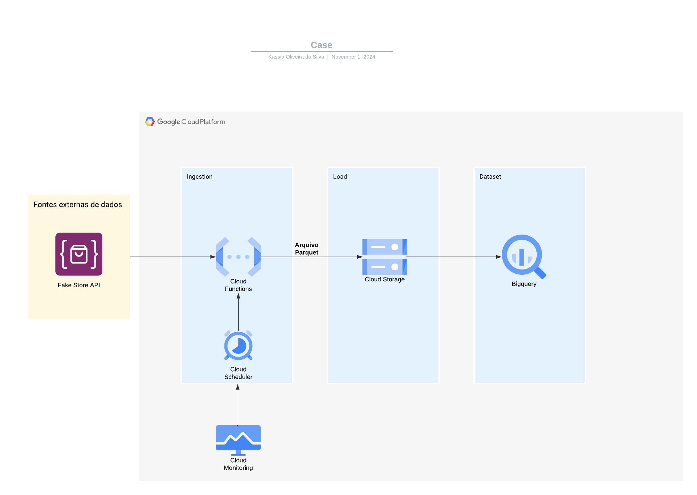

# Documentação Arquitetura

# Arquitetura

## Descrição

Este projeto é uma pipeline de dados implementada no Google Cloud Platform (GCP) para capturar dados da API externa Fake Store API https://fakestoreapi.com/, armazená-los no formato Parquet no Cloud Storage e disponibilizá-los para análise no BigQuery. A execução do processo é automatizada com o uso de Cloud Scheduler e monitorada através do Cloud Monitoring.

### Componentes

* Fontes Externas de Dados:
  
  Fake Store API: API pública que fornece dados de exemplo sobre produtos, usada como fonte de dados para esta pipeline.
  
* Ingestion:
  
  Cloud Scheduler: Configurado para disparar a execução diária do processo de ingestão.
  
  Cloud Functions: Função `Python 3.10` que conecta-se à API, realiza a extração e transforma os dados em um arquivo Parquet. Este arquivo é salvo no Cloud Storage para armazenamento.
  
* Load:
  
  Cloud Storage: Armazena o arquivo Parquet gerado pela Function. O Cloud Storage atua como uma camada intermediária para permitir que o BigQuery acesse os dados sem a necessidade de movimentação adicional.
  
* Dataset:
  
  BigQuery: Consome diretamente o arquivo Parquet armazenado no Cloud Storage.

* Monitoramento:
  
  Cloud Monitoring: Monitora a execução do Cloud Scheduler e do Cloud Function, enviando alertas em caso de falhas ou problemas de desempenho.

### Fluxo de Dados
- O Cloud Scheduler inicia a execução da Cloud Function seguindo o cronograma configurado (diariamente).
- A Cloud Function conecta-se à Fake Store API, extrai e transforma os dados, e os salva no formato Parquet no Cloud Storage.
- O BigQuery acessa o arquivo Parquet diretamente do Cloud Storage

# Documentação Python

O código `cloudFunction.py` é uma função que roda no Google Cloud Functions. Ela coleta dados de carrinhos de compra e produtos de uma API chamada Fake Store API, processa essas informações para identificar as categorias de produtos mais compradas por cada usuário, e salva tudo em um arquivo Parquet no Google Cloud Storage.

## Dependências
- requests: Para fazer solicitações HTTP à API.
- pandas: Para manipulação e criação de DataFrames.
- google.cloud.storage: Para interagir com o Google Cloud Storage.
  
## Como funciona

* Coleta de Dados

  O código faz duas requisições para a Fake Store API: uma para pegar os carrinhos de compra `(/carts)` e outra para pegar os produtos `(/products)`.
  Se as requisições forem bem-sucedidas, ele segue em frente; se não, retorna uma mensagem de erro.

* Processamento

  Para cada produto, ele guarda a categoria correspondente.
  Em seguida, percorre cada carrinho e calcula para cada usuário:
    - A última vez que adicionou algo ao carrinho.
    - As categorias de produtos mais comuns nos carrinhos.
  
- Gera um resumo para cada usuário com:

   - ID do usuário.
   - Última data de adição ao carrinho.
   - A categoria de produto mais frequente no carrinho.
   - Data e hora de processamento.

* Salvamento

  Cria um DataFrame pandas com esses dados e salva como arquivo Parquet em um diretório temporário.
  Envia o arquivo para um bucket no Google Cloud Storage, usando um nome que inclui o timestamp para ser único.

* Resultado
  - Estrutura do Arquivo Parquet
    
    - `user_id`: ID do usuário.
    - `last_add_date`: Data da última adição ao carrinho do usuário.
    - `top_category`: Categoria mais frequente dos produtos adicionados ao carrinho.
    - `data_process`: Data e hora do processamento

